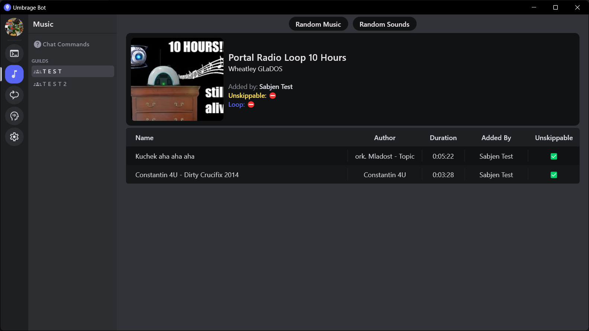

#  Umbrage Bot

Umbrage Bot is a Discord Bot designed to be annoying - although it can be configured to be a normal bot. It offers an UI heavily inspired by Discord where the bot can be configured and have its activity tracked. The application can store multiple bots, but can only run one at any time.

## Features
- Console to view logs
### Music Player:
- Users can play, skip and loop music from Youtube in a dedicated music channel
- Songs can be unskippable (good for those that want to listen to full 10-hour videos)
- The bot can queue music by his own based on what was previously queued by users
- The bot can rarely boost the music volume to deafen everyone listening to him.

### Lexicon:
- It holds messages that the bot can send when specific events occur - for example, when the bot is mentioned, or when an user connects to a voice channel
- Messages can be turned into conversations, where the bot will wait for a response until sending the next message
- The bot can have custom variables, which hold words that can be used in messages, so that the bot's responses can be more unique and creative

### Multiple extensions:
- Mute-Nuke: The bot will kick users that stay on mute in a voice channel - no more need for an afk channel!
- Profile Picture Changer: You can have multiple profile pictures loaded that the bot will periodically switch
- More to come...

- Many settings to configure the bot to your liking.
